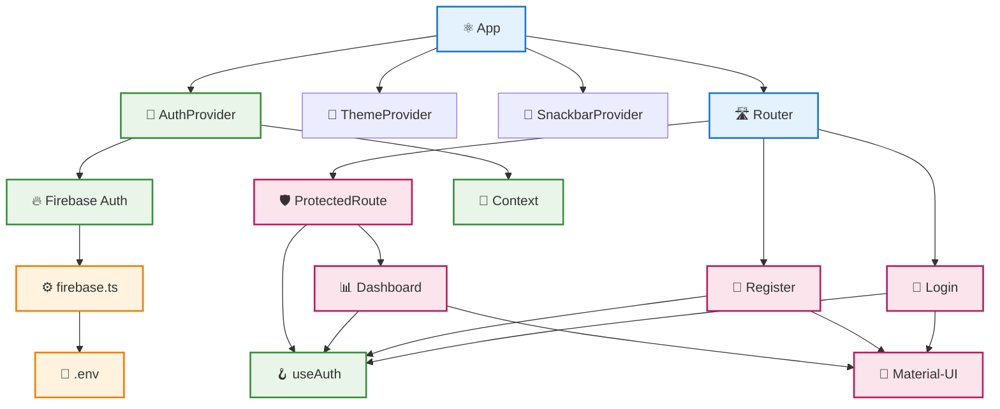
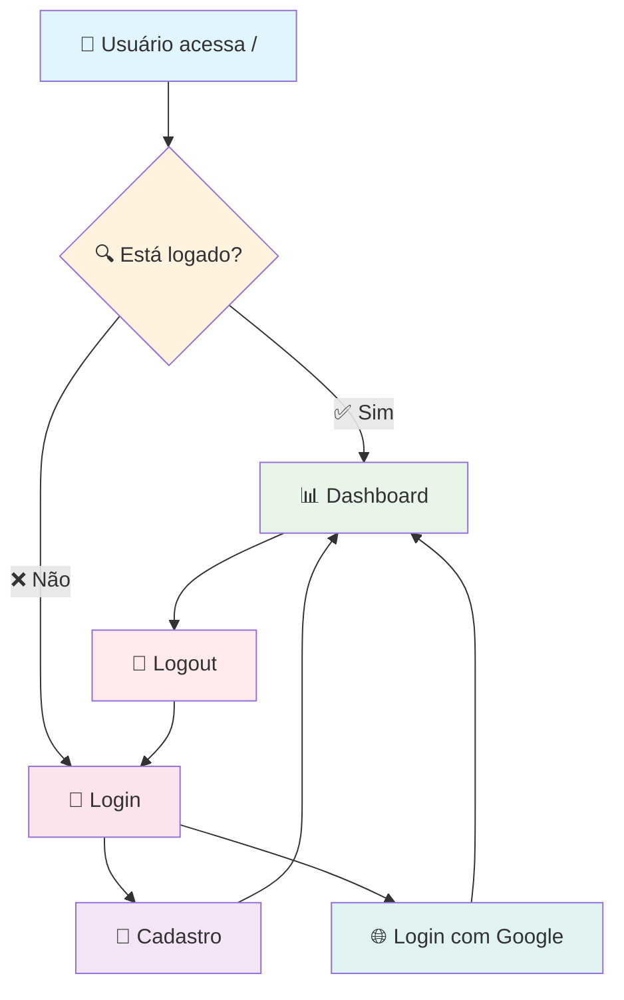
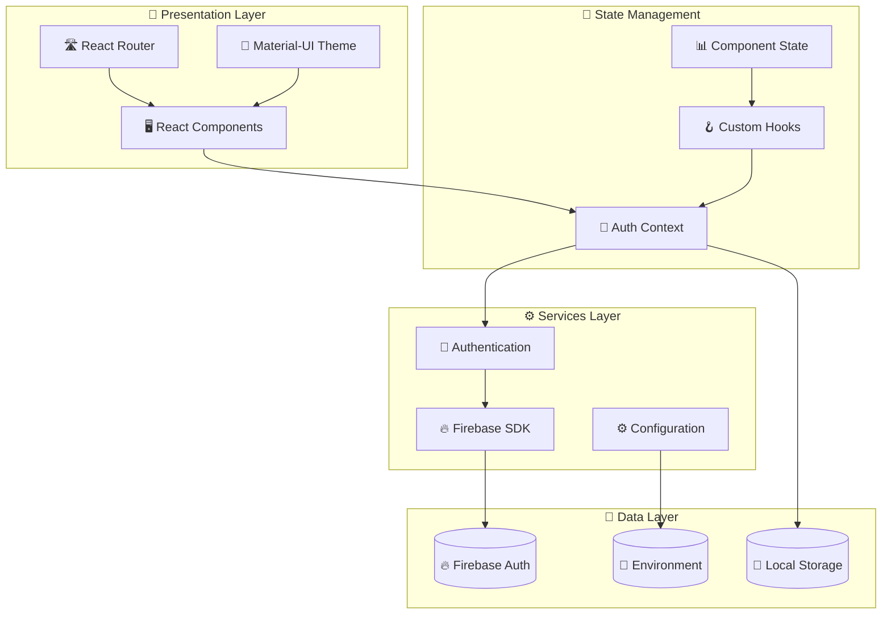
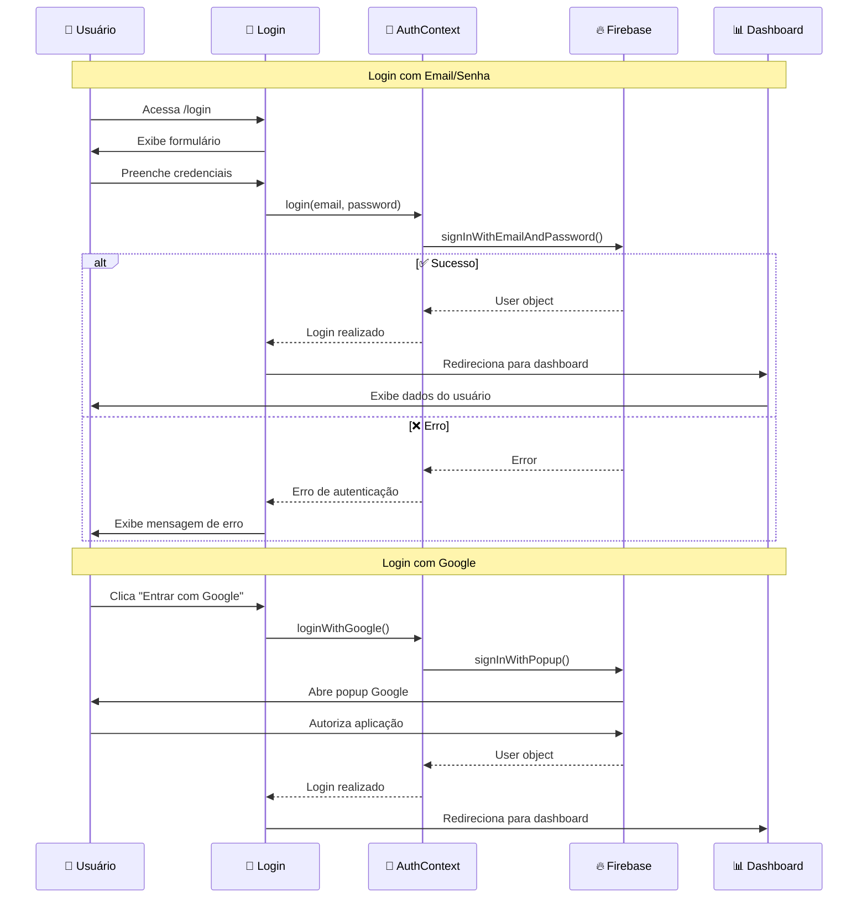

# 🔐 Sistema de Autenticação Firebase

> Sistema completo de login e cadastro usando React, TypeScript, Material-UI e Firebase Authentication

[](https://reactjs.org/)
[](https://www.typescriptlang.org/)
[](https://mui.com/)
[](https://firebase.google.com/)
[](https://vitejs.dev/)

## 📋 Índice

- [Funcionalidades](#-funcionalidades)
- [Tecnologias](#️-tecnologias-utilizadas)
- [Pré-requisitos](#-pré-requisitos)
- [Instalação](#-instalação)
- [Configuração Firebase](#-configuração-firebase)
- [Estrutura do Projeto](#-estrutura-do-projeto)
- [Como Usar](#-como-usar)
- [Rotas Disponíveis](#-rotas-disponíveis)
- [Componentes](#-componentes-principais)
- [Personalização](#-personalização)
- [Deploy](#-deploy)
- [Contribuição](#-contribuição)
- [Licença](#-licença)

## 🚀 Funcionalidades

### ✅ **Autenticação Completa**
- 🔑 Login com email e senha
- 📝 Cadastro de novos usuários
- 🌐 Login social com Google
- 🔒 Rotas protegidas
- 🚪 Logout seguro
- 💾 Persistência de sessão

### ✅ **Interface Moderna**
- 🎨 Design Material-UI
- 📱 Totalmente responsivo
- 🌙 Tema customizável
- ⚡ Feedback visual (snackbars)
- 🔄 Estados de loading
- ✨ Animações suaves

### ✅ **Segurança & Qualidade**
- 🛡️ TypeScript para type safety
- 🔐 Variáveis de ambiente
- 📊 Validação de formulários
- 🚫 Proteção de rotas
- 🔍 Tratamento de erros

## 🛠️ Tecnologias Utilizadas

| Tecnologia | Versão | Descrição |
|------------|--------|-----------|
| **React** | 18.2.0 | Biblioteca para interfaces |
| **TypeScript** | 4.9.3 | Tipagem estática |
| **Material-UI** | 5.15.0 | Componentes de interface |
| **Firebase** | 10.7.1 | Backend e autenticação |
| **React Router** | 6.8.1 | Roteamento SPA |
| **Vite** | 4.1.0 | Build tool moderna |
| **Notistack** | 3.0.1 | Notificações |

## 📋 Pré-requisitos

Antes de começar, certifique-se de ter instalado:

- **Node.js** (versão 16 ou superior) - [Download](https://nodejs.org/)
- **npm** ou **yarn** - Gerenciador de pacotes
- **Git** - Para controle de versão
- **Conta Google** - Para criar projeto Firebase (gratuito)

## ⚡ Instalação

### 1. Clone o repositório
```bash
git clone <url-do-repositorio>
cd sistema-login-firebase
```

### 2. Instale as dependências
```bash
npm install
# ou
yarn install
```

### 3. Configure as variáveis de ambiente
```bash
cp .env.example .env
```

### 4. Configure o Firebase (veja seção abaixo)

### 5. Inicie o servidor de desenvolvimento
```bash
npm run dev
# ou
yarn dev
```

### 6. Acesse a aplicação
```
http://localhost:3000
```

## 🔥 Configuração Firebase

### 🔥 Configuração Rápida

> **💡 Dica:** Consulte o arquivo `FIREBASE_SETUP.md` para um guia detalhado passo-a-passo

#### 1. Criar Projeto Firebase
1. Acesse [Firebase Console](https://console.firebase.google.com/)
2. Clique em **"Criar um projeto"**
3. Nome: `sistema-login-teste`
4. Desabilite Google Analytics (opcional)

#### 2. Configurar Authentication
1. **Authentication** → **Começar**
2. **Sign-in method** → Habilite:
   - ✅ **Email/Password**
   - ✅ **Google** (opcional)

#### 3. Obter Configurações
1. ⚙️ **Configurações do projeto**
2. **Seus apps** → **Web** (`</>`)
3. Nome: `Sistema Login Web`
4. Copie as configurações

#### 4. Configurar Variáveis
Edite o arquivo `.env`:
```env
VITE_FIREBASE_API_KEY=AIzaSy...
VITE_FIREBASE_AUTH_DOMAIN=seu-projeto.firebaseapp.com
VITE_FIREBASE_PROJECT_ID=seu-projeto-id
VITE_FIREBASE_STORAGE_BUCKET=seu-projeto.appspot.com
VITE_FIREBASE_MESSAGING_SENDER_ID=123456789
VITE_FIREBASE_APP_ID=1:123456789:web:abc123
```

#### 5. Reiniciar Servidor
```bash
npm run dev
```

## 📁 Estrutura do Projeto

```
📦 sistema-login-firebase/
├── 📂 public/                    # Arquivos públicos
│   └── vite.svg                 # Favicon
├── 📂 src/                      # Código fonte
│   ├── 📂 components/           # Componentes React
│   │   ├── 🔐 Login.tsx         # Tela de login
│   │   ├── 📝 Register.tsx      # Tela de cadastro
│   │   ├── 📊 Dashboard.tsx     # Dashboard do usuário
│   │   └── 🛡️ ProtectedRoute.tsx # Rota protegida
│   ├── 📂 contexts/             # Contextos React
│   │   └── 🔑 AuthContext.tsx   # Contexto de autenticação
│   ├── 📂 config/               # Configurações
│   │   └── 🔥 firebase.ts       # Configuração do Firebase
│   ├── 📂 types/                # Tipos TypeScript
│   │   └── 📋 index.ts          # Tipos da aplicação
│   ├── 🎯 App.tsx               # Componente principal
│   ├── 🚀 main.tsx              # Ponto de entrada
│   └── 🌐 vite-env.d.ts         # Tipos do Vite
├── 📄 package.json              # Dependências
├── 📄 tsconfig.json             # Config TypeScript
├── 📄 vite.config.ts            # Config Vite
├── 📄 .env.example              # Template variáveis
├── 📄 .env                      # Variáveis (não commitado)
├── 📄 .gitignore                # Arquivos ignorados
├── 📖 README.md                 # Documentação
├── 📖 FIREBASE_SETUP.md         # Guia Firebase
└── 📖 DOCS.md                   # Documentação técnica
```

### 🌳 Árvore de Dependências



## 🌐 Rotas Disponíveis

| Rota | Componente | Descrição | Proteção |
|------|------------|-----------|----------|
| `/` | `App` | Redireciona para dashboard ou login | - |
| `/login` | `Login` | Tela de autenticação | Pública |
| `/register` | `Register` | Tela de cadastro | Pública |
| `/dashboard` | `Dashboard` | Área do usuário logado | 🔒 Protegida |

### 🔄 Fluxo de Navegação



## 🏗️ Arquitetura do Sistema

### 📊 Diagrama de Arquitetura

O sistema segue uma arquitetura moderna com separação clara de responsabilidades:



## 🎯 Como Usar

### 🚀 **Início Rápido**

1. **Acesse a aplicação:** `http://localhost:3000`
2. **Primeira vez?** Clique em "Não tem uma conta? Cadastre-se"
3. **Já tem conta?** Faça login diretamente

### 📝 **Cadastro de Usuário**

```bash
# Acesse: http://localhost:3000/register
```

**Opções disponíveis:**
- ✅ **Cadastro manual:** Nome + Email + Senha
- ✅ **Cadastro Google:** Um clique

**Validações:**
- 📧 Email válido
- 🔒 Senha mínimo 6 caracteres
- ✔️ Confirmação de senha

### 🔑 **Login**

```bash
# Acesse: http://localhost:3000/login
```

**Métodos de autenticação:**
- 🔐 **Email/Senha:** Credenciais cadastradas
- 🌐 **Google OAuth:** Login social
- 👁️ **Mostrar/Ocultar senha:** Toggle de visibilidade

### 📊 **Dashboard (Área Protegida)**

Após login bem-sucedido:
- ✅ **Informações do usuário:** Nome, email, UID
- ✅ **Dados da conta:** Data criação, último login
- ✅ **Avatar:** Foto do Google ou inicial do nome
- ✅ **Logout seguro:** Botão de sair

### 🔄 Fluxo de Autenticação



## 🧩 Componentes Principais

### 🔑 **AuthContext**
```typescript
// Gerenciamento global de autenticação
const { currentUser, login, logout, signup } = useAuth();
```

**Funcionalidades:**
- ✅ Estado global do usuário
- ✅ Métodos de autenticação
- ✅ Persistência de sessão
- ✅ Loading states

### 🛡️ **ProtectedRoute**
```typescript
// Proteção de rotas
<ProtectedRoute>
  <Dashboard />
</ProtectedRoute>
```

**Características:**
- ✅ Redirecionamento automático
- ✅ Loading durante verificação
- ✅ Proteção contra acesso não autorizado

### 🎨 **Componentes de UI**

| Componente | Responsabilidade | Recursos |
|------------|------------------|----------|
| `Login` | Autenticação | Email/senha, Google, validação |
| `Register` | Cadastro | Formulário completo, validações |
| `Dashboard` | Área logada | Perfil, informações, logout |

## 🛡️ Segurança & Boas Práticas

### 🔒 **Autenticação**
- ✅ **Firebase Auth:** Autenticação robusta e segura
- ✅ **Tokens JWT:** Gerenciados automaticamente
- ✅ **Sessão persistente:** Login mantido entre sessões
- ✅ **Logout seguro:** Limpeza completa da sessão

### 🛡️ **Proteção de Rotas**
- ✅ **ProtectedRoute:** Componente de proteção
- ✅ **Redirecionamento:** Usuários não logados → Login
- ✅ **Loading states:** Feedback durante verificação

### 🔐 **Dados Sensíveis**
- ✅ **Variáveis de ambiente:** Chaves Firebase protegidas
- ✅ **GitIgnore:** `.env` não commitado
- ✅ **Validação:** Formulários com validação client-side

### ⚡ **Performance**
- ✅ **Code splitting:** Carregamento otimizado
- ✅ **Lazy loading:** Componentes sob demanda
- ✅ **Memoização:** Otimização de re-renders

## 🎨 Personalização

### Tema Material-UI
Edite `src/App.tsx` para personalizar cores e tipografia:

```typescript
const theme = createTheme({
  palette: {
    primary: {
      main: '#1976d2', // Sua cor primária
    },
    secondary: {
      main: '#dc004e', // Sua cor secundária
    },
  },
});
```

## 📱 Responsividade

A aplicação é totalmente responsiva e funciona bem em:
- Desktop
- Tablet
- Mobile

## 🚀 Build para Produção

```bash
npm run build
```

Os arquivos otimizados serão gerados na pasta `dist/`.

## 🤝 Contribuição

1. Fork o projeto
2. Crie uma branch para sua feature (`git checkout -b feature/AmazingFeature`)
3. Commit suas mudanças (`git commit -m 'Add some AmazingFeature'`)
4. Push para a branch (`git push origin feature/AmazingFeature`)
5. Abra um Pull Request

## 📋 Scripts Disponíveis

| Comando | Descrição | Uso |
|---------|-----------|-----|
| `npm run dev` | Inicia servidor de desenvolvimento | Desenvolvimento local |
| `npm run build` | Gera build de produção | Deploy |
| `npm run preview` | Preview do build | Testar build local |
| `npm run lint` | Executa ESLint | Verificar código |
| `npm run lint:fix` | Corrige problemas ESLint | Corrigir automaticamente |

## 🔗 Links Úteis

### 📚 **Documentação**
- [React Documentation](https://react.dev/) - Biblioteca principal
- [TypeScript Handbook](https://www.typescriptlang.org/docs/) - Tipagem
- [Material-UI](https://mui.com/) - Componentes UI
- [Firebase Auth](https://firebase.google.com/docs/auth) - Autenticação
- [React Router](https://reactrouter.com/) - Roteamento
- [Vite Guide](https://vitejs.dev/guide/) - Build tool

### 🛠️ **Ferramentas**
- [Firebase Console](https://console.firebase.google.com/) - Gerenciar projeto
- [React DevTools](https://react.dev/learn/react-developer-tools) - Debug React
- [VS Code Extensions](https://marketplace.visualstudio.com/items?itemName=ms-vscode.vscode-typescript-next) - TypeScript

## 🐛 Troubleshooting

### ❌ **Problemas Comuns**

| Problema | Solução |
|----------|---------|
| `Firebase config not found` | Verificar arquivo `.env` |
| `Auth domain not authorized` | Adicionar domínio no Firebase Console |
| `Google login não funciona` | Verificar configuração OAuth |
| `Build falha` | Verificar dependências e tipos |

### 🔧 **Debug**

```bash
# Verificar configuração
npm run build

# Limpar cache
rm -rf node_modules package-lock.json
npm install

# Verificar variáveis de ambiente
echo $VITE_FIREBASE_API_KEY
```

## 🤝 Contribuição

1. **Fork** o projeto
2. **Clone** seu fork: `git clone <seu-fork>`
3. **Branch** para feature: `git checkout -b feature/nova-funcionalidade`
4. **Commit** mudanças: `git commit -m 'Add: nova funcionalidade'`
5. **Push** para branch: `git push origin feature/nova-funcionalidade`
6. **Pull Request** para main

### 📝 **Padrões de Commit**
- `feat:` Nova funcionalidade
- `fix:` Correção de bug
- `docs:` Documentação
- `style:` Formatação
- `refactor:` Refatoração
- `test:` Testes

## 📄 Licença

Este projeto está sob a licença **MIT**. Veja o arquivo `LICENSE` para mais detalhes.

## 🆘 Suporte

### 💬 **Precisa de Ajuda?**

1. 📖 Consulte a [documentação completa](./FIREBASE_SETUP.md)
2. 🔍 Verifique os [issues](../../issues) existentes
3. 🐛 Reporte bugs criando um [novo issue](../../issues/new)
4. 💡 Sugira melhorias nas [discussions](../../discussions)

### 🔍 **Verificações Básicas**
- ✅ Node.js versão 16+
- ✅ Dependências instaladas (`npm install`)
- ✅ Arquivo `.env` configurado
- ✅ Firebase projeto criado
- ✅ Authentication habilitado

---

<div align="center">

**Desenvolvido com ❤️ usando React + Firebase**

[](https://reactjs.org/)
[](https://www.typescriptlang.org/)
[](https://firebase.google.com/)
[](https://mui.com/)

</div>
